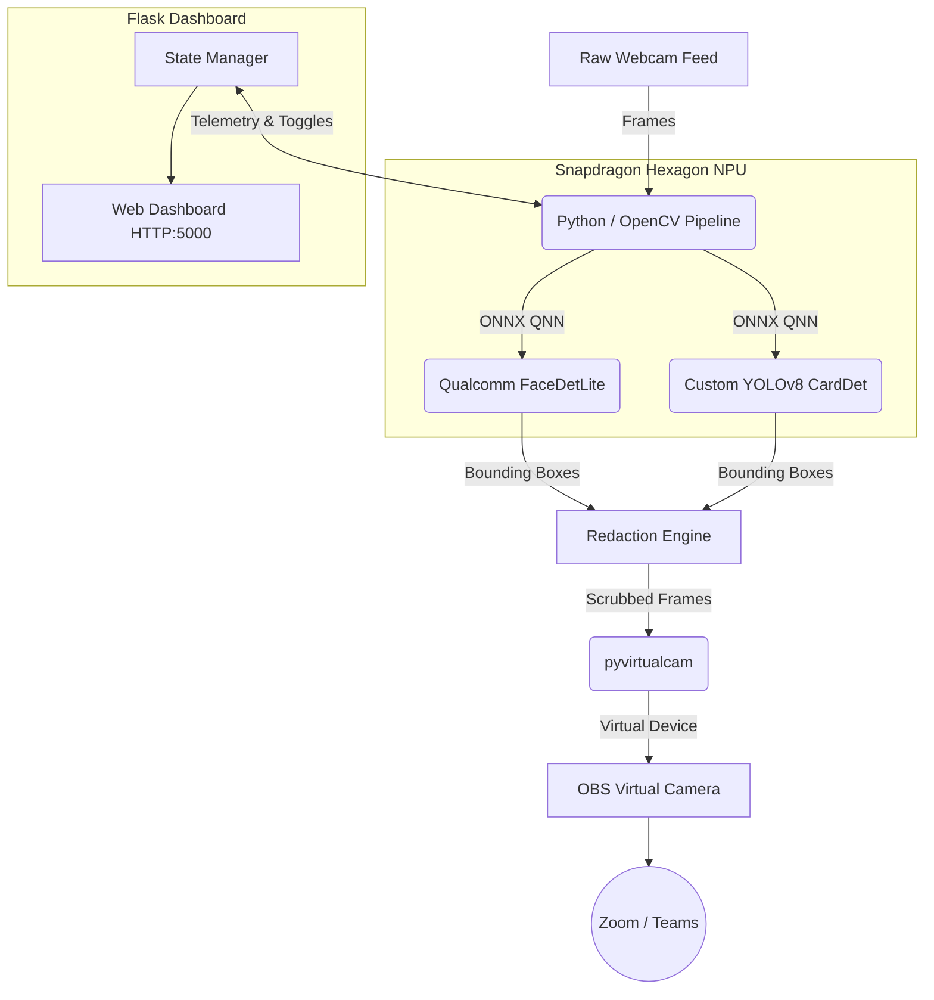

# 👁️ Dragon's Blink: PrivacyGuard 🛡️


**Real-Time, NPU-Accelerated Edge AI for Video Conferencing Privacy.**

Dragon's Blink is a high-performance virtual camera pipeline built specifically for **Windows ARM64 architecture and Snapdragon chipsets**. It intercepts raw webcam streams, utilizes heavily optimized edge-AI models to detect and redact sensitive PII (Faces, Credit Cards, ID Cards) in real-time, and securely pipes the scrubbed feed into OBS Virtual Camera for use in Zoom, Teams, or Meet.

Forget cloud latency and massive CPU drain. By leveraging the **Qualcomm AI Hub** and the **Snapdragon Hexagon NPU**, Dragon's Blink runs completely locally with buttery-smooth framerates.

---

## ⚡ Key Features

- **🚀 Snapdragon NPU Acceleration**: Built on ONNX Runtime utilizing the `QNNExecutionProvider`. Offloads heavy tensor math entirely to the Hexagon NPU on devices like the Snapdragon X Elite, achieving near-zero latency while saving massive amounts of battery.
- **🧠 Qualcomm AI Hub Integration**: Uses the mathematically optimized `FaceDetLite` model sourced directly from the Qualcomm AI Hub library for ultra-fast face tracking.
- **💳 Custom Financial PII Detection**: Includes a custom YOLOv8 model fine-tuned to instantly catch and redact Identity Cards and Credit Cards held up to the camera.
- **☁️ Automated Cloud Profiling**: Features a built-in CI/CD profiling script (`profile_on_ai_hub.py`) that uses the `qai-hub` SDK to compile and benchmark your models on physical Snapdragon cloud hardware.
- **✨ Premium Glassmorphism Dashboard**: Features a threaded Flask backend serving a modern, sleek web UI. Dynamically toggle redaction models on/off mid-call and watch your real-time telemetry (NPU FPS, objects caught).

---

## 🏗️ Architecture



---

## 🛠️ Getting Started

### 1. Prerequisites
- **OS**: Windows 11 (ARM64 recommended for NPU, x86 supported via CPU fallback)
- **Python**: `3.10+`
- **OBS Studio**: Installed with the **Virtual Camera** plugin activated.

### 2. Installation

Clone the repository and install dependencies:
```bash
git clone https://github.com/akshitag001/DRAGONS-BLINK.git
cd DRAGONS-BLINK/privacyguard
python -m venv venv
.\venv\Scripts\activate
pip install -r requirements.txt
```

### 3. Model Preparation
Export the Qualcomm Face model and train the Card detector:
```bash
# Export FaceDetLite to ONNX
python export_model.py

# Fine-tune the YOLOv8 Card detector
python scripts/train_card_detector.py
```

### 4. Run the Pipeline!
Ensure your OBS Virtual Camera is running, then launch the premium dashboard:
```bash
python dashboard.py
```
Open **`http://localhost:5000`** in your browser to view the real-time telemetry and control the redaction pipeline!

---

## 📊 Qualcomm AI Hub Cloud Profiling

Want to benchmark exactly how fast these models run on a real Snapdragon X Elite? 
Configure your API token and run our dedicated profiling script:

```bash
qai-hub configure --api_token <YOUR_TOKEN>
python scripts/profile_on_ai_hub.py
```
This script uploads the models to Qualcomm AI Hub, compiles them for the **Snapdragon X Elite CRD**, executes a physical profiling job in the cloud farm, and downloads the raw latency/memory metrics.
